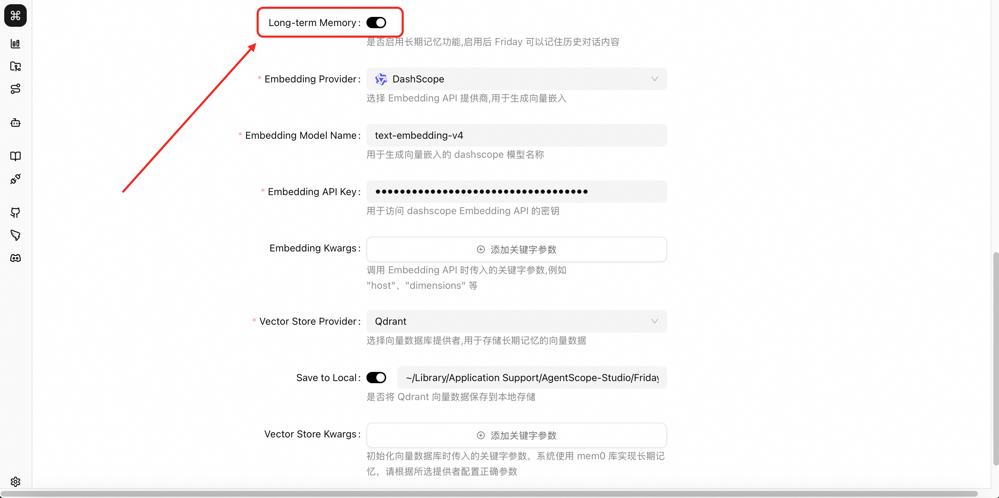
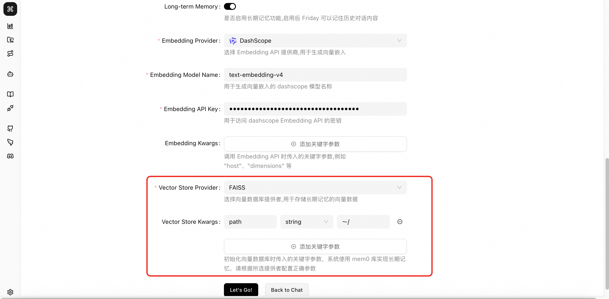

# Long-Term Memory

Friday supports storing memories in a local database to enable long-term memory.

## How to Set Up Long-Term Memory

In the settings interface, click to enable long-term memory, and fill in the Embedding model and vector database related settings

## Database Selection

- The system has default configuration for Qdrant. Simply choose whether to save to disk, fill in the memory storage address, and you can use long-term memory.
- If you need to use other vector databases to store memories, please select the corresponding database provider and fill in the required parameters. Friday implements long-term memory based on the mem0 library. You can find the corresponding file in the configs/vector_stores folder of the mem0 library to view the specific parameters required for each database.
  
