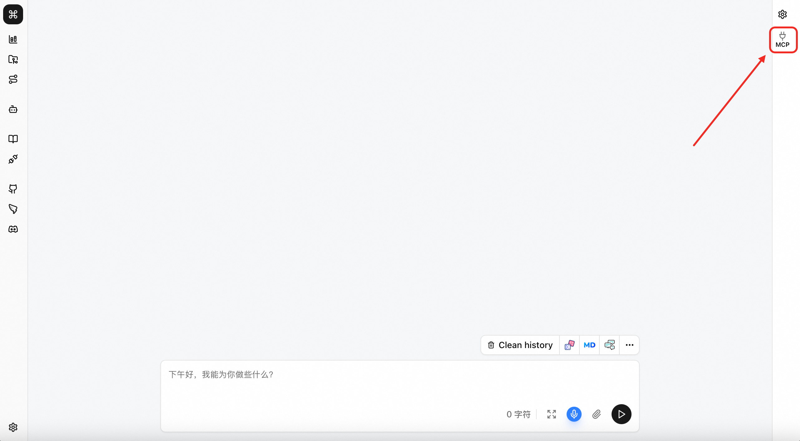
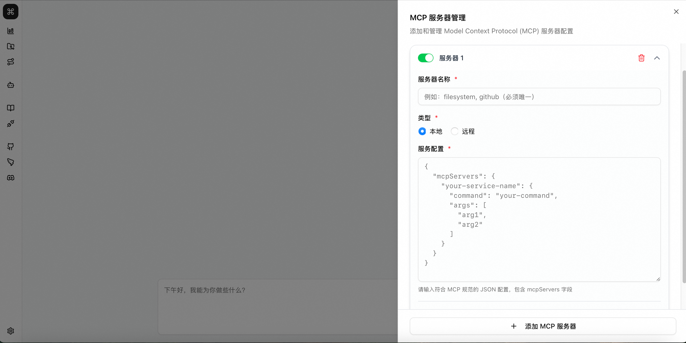
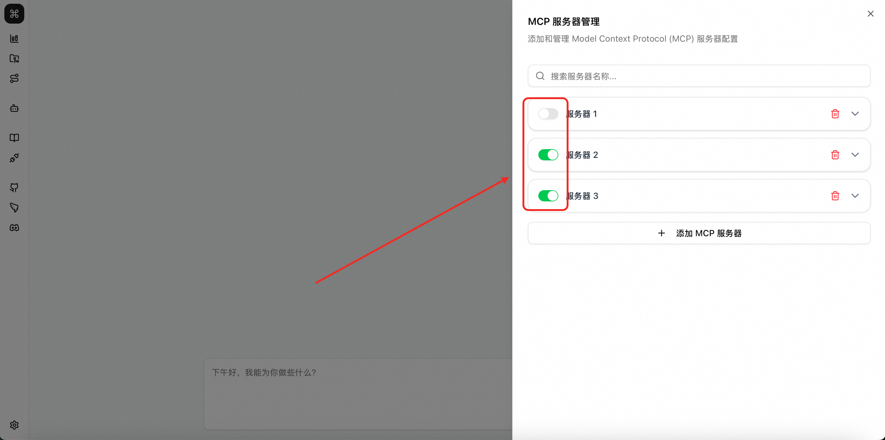

# MCP Server Management

Friday supports dynamic management of MCP servers:

- Add and remove MCP servers
- Enable and disable specific MCP servers at any time
- Support both remote and local MCP server types

## Adding MCP Servers

1. Click the MCP button on the right side of the Friday chat interface to open the MCP server management interface
   

2. Write the MCP server configuration and click Save
   

## Enabling and Disabling MCP Servers

During usage, you can enable or disable specific MCP servers through this switch

