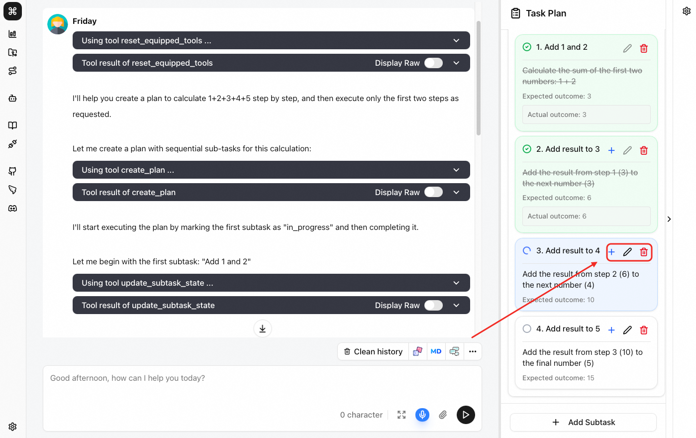
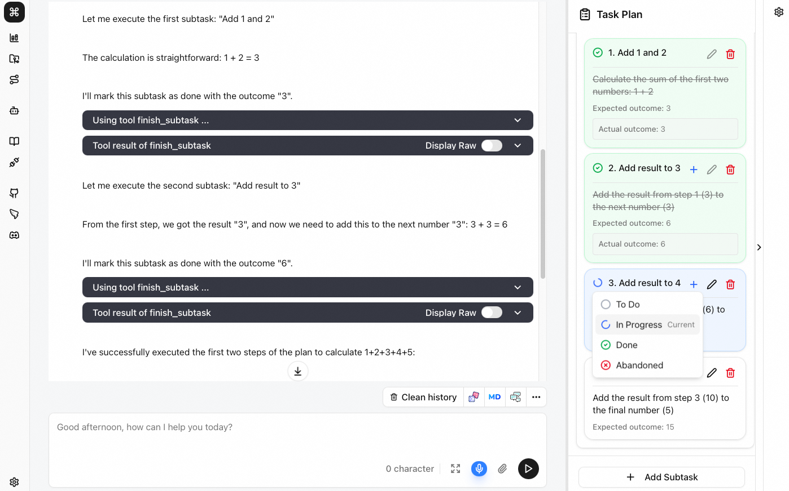

# Planning

When facing complex problems, Friday automatically creates a task plan and executes it step by step.

- Supports inserting, deleting, and editing subtasks.
- Supports modifying the current status of subtasks.
- Supports reordering unexecuted subtasks via `drag and drop`.

> **⚠️ Note: Completed subtasks do not support any modifications except deletion.**

## Edit Subtasks

For existing subtasks, use the insert, edit, and delete buttons shown below.

## Modify Subtask Status

Click the subtask status icon to change its current status.

