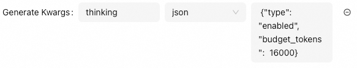
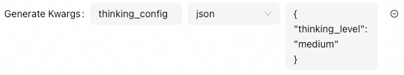

# Reasoning Mode

Friday supports enabling model reasoning mode and displaying the model's reasoning process.

## How to Enable Reasoning Mode

If the model supports reasoning mode, Friday enables it by passing parameters when calling the model API. The parameters supported by different model providers are as follows:

| Model Provider | Parameter Name | Available Values | Description |
|----------------|---------------|------------------|-------------|
| **OpenAI** (o1/o3) | `reasoning_effort` | `low` / `medium` / `high` | Controls thinking depth, default is medium |
| **Anthropic** (Claude 3.7+) | `thinking` | `{"type": "enabled", "budget_tokens": 1024-128000}` | Extended thinking mode, requires token budget |
| **Gemini** (3.0+) | `thinking_config` | `{"thinking_level": "low/medium/high"}` | Controls reasoning level, high activates Deep Think |
| **Ollama** (DeepSeek R1/Qwen 3) | `think` | `true` / `false` | Enable/disable reasoning mode |
| **DashScope** (Qwen) | `enable_thinking` | `true` / `false` | Only supports streaming output |

## Configuration Examples

All reasoning mode parameters are passed through **`generate_kwargs`**:

### DashScope (Alibaba Cloud)

> **Note**: For non-streaming calls, you must set `enable_thinking=False`, otherwise an error will occur

### OpenAI

### Anthropic (Claude)

### Google Gemini

> **Note**: Gemini 2.5 uses `thinking_budget` parameter (integer value), while Gemini 3+ uses `thinking_level`

### Ollama

## Parameter Selection Recommendations

| Task Type | Recommended Level | Description |
|-----------|------------------|-------------|
| Simple Tasks (translation, classification, data extraction) | `low` | Fast response, low cost |
| Daily Development (code generation, content writing, debugging) | `medium` | Balance performance and cost |
| Complex Reasoning (mathematical proofs, scientific analysis, algorithm design) | `high` | Deep reasoning, high-quality output |
