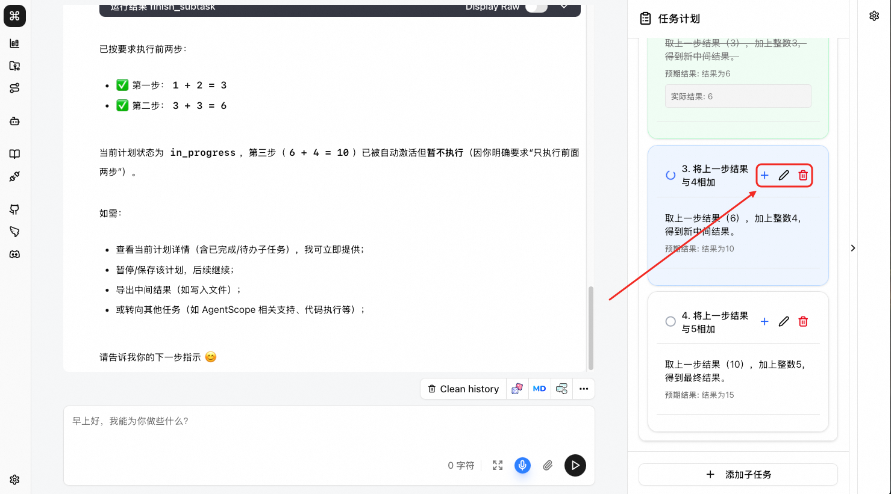
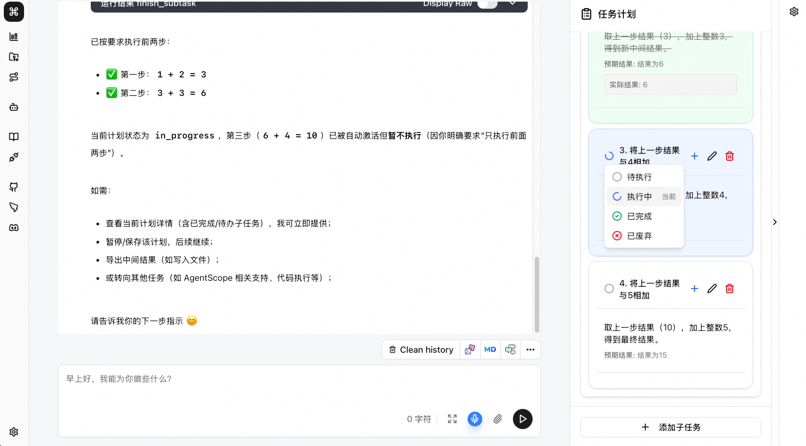

# 计划管理

Friday在面对复杂问题时会自动创建任务计划，并按计划分步执行

- 支持用户对子任务的插入，删除，修改。
- 支持用户修改子任务当前状态。
- 支持用户通过`拖拽`修改未执行子任务的执行顺序。

> **⚠️ 注意：状态为已完成的子任务除了删除之外不支持任何修改操作**

## 编辑子任务

对于已经存在的子任务，可以使用以下插入，修改，删除按钮进行编辑。

## 修改子任务当前状态

点击子任务状态图标，可以修改当前状态

