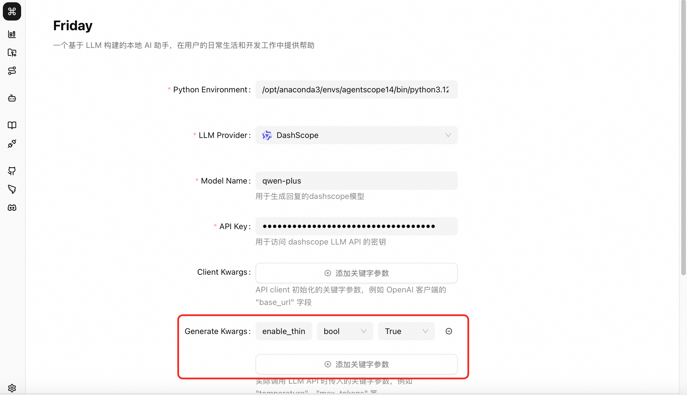

# 思考模式
Friday支持开启模型思考模式,并将模型思考内容进行展示。


## 如何开启思考模式
如果模型支持思考模式,Friday通过在调用模型API时传入参数以开启模型思考模式。
不同模型提供者所支持开启模型思考模式参数如下:

### OpenAI

OpenAI的推理模型(o1、o3系列)通过 `reasoning_effort` 参数控制思考深度,支持三个等级:

- **low**: 快速响应,较少思考token,适合简单任务
- **medium**: 平衡速度和推理深度(默认值),适合大多数场景
- **high**: 深度推理,生成更多思考token,适合复杂任务

```python
# 使用 agentscope 封装的 OpenAIChatModel
from agentscope.model import OpenAIChatModel

model = OpenAIChatModel(
    model_name="o1",
    api_key="your_api_key",
    stream=True,
    generate_kwargs={
        "reasoning_effort": "medium"  # 可选: low, medium, high
    }
)
```

### Anthropic (Claude)

Claude 3.7及以上版本支持扩展思考模式(Extended Thinking),通过 `thinking` 对象配置:

- `type`: 设置为 `"enabled"` 开启思考模式
- `budget_tokens`: 分配用于内部推理的token数量(1024-128000)

```python
# 使用 agentscope 封装的 AnthropicChatModel
from agentscope.model import AnthropicChatModel

model = AnthropicChatModel(
    model_name="claude-3.7-sonnet",
    api_key="your_api_key",
    stream=True,
    generate_kwargs={
        "thinking": {
            "type": "enabled",
            "budget_tokens": 16000
        }
    }
)
```

### Google Gemini

Gemini 3及以上版本通过 `thinking_level` 参数控制思考级别:

- **low**: 最快速度,最低成本,适合简单任务(翻译、分类等)
- **medium**: 平衡性能和成本,适合日常开发任务(代码生成、内容写作等)
- **high**: 激活Deep Think Mini模式,适合复杂推理任务(数学证明、科学分析等)

```python
# 使用 agentscope 封装的 GeminiChatModel
from agentscope.model import GeminiChatModel

model = GeminiChatModel(
    model_name="gemini-3.1-pro-preview",
    api_key="your_api_key",
    stream=True,
    generate_kwargs={
        "thinking_config": {
            "thinking_level": "medium"  # 可选: low, medium, high
        }
    }
)
```

> **注意**: Gemini 2.5版本使用 `thinking_budget` 参数(整数值),而Gemini 3+版本使用 `thinking_level`

### Ollama

Ollama支持的推理模型(如DeepSeek R1、Qwen 3)通过 `think` 参数控制思考模式:

- `true`: 开启思考模式,将思考过程与输出分离
- `false`: 关闭思考模式,直接输出结果

```python
# 使用 agentscope 封装的 OllamaChatModel
from agentscope.model import OllamaChatModel

model = OllamaChatModel(
    model_name="deepseek-r1",
    stream=True,
    generate_kwargs={
        "think": True  # 开启思考模式
    }
)
```

### DashScope (阿里云)

DashScope的通义千问模型通过 `enable_thinking` 参数控制思考模式:

- `true`: 开启思考模式(仅支持流式输出 `stream=True`)
- `false`: 关闭思考模式

```python
# 使用 agentscope 封装的 DashScopeChatModel
from agentscope.model import DashScopeChatModel

model = DashScopeChatModel(
    model_name="qwen-plus",
    api_key="your_api_key",
    stream=True,  # 思考模式必须使用流式输出
    generate_kwargs={
        "enable_thinking": True  # 开启思考模式
    }
)
```

> **注意**: 非流式调用时必须设置 `enable_thinking=False`,否则会报错

## 参数选择建议

不同任务类型建议使用的思考级别:

| 任务类型 | OpenAI | Claude | Gemini | 说明 |
|---------|--------|--------|--------|---------||
| 简单任务(翻译、分类、数据提取) | low | 较少budget | low | 快速响应,低成本 |
| 日常开发(代码生成、内容写作、调试) | medium | 中等budget | medium | 平衡性能与成本 |
| 复杂推理(数学证明、科学分析、算法设计) | high | 较多budget | high | 深度推理,高质量输出 |

## 在 Friday 中配置思考模式

Friday 通过 `generate_kwargs` 和 `client_kwargs` 参数传递给 agentscope 模型。根据不同的模型提供者,配置方式如下:

### 配置示例

```python
from friday.model import get_model

# OpenAI - 使用 generate_kwargs
model = get_model(
    llmProvider="openai",
    modelName="o1",
    apiKey="your_api_key",
    generate_kwargs={
        "reasoning_effort": "medium"
    }
)

# Anthropic - 使用 generate_kwargs
model = get_model(
    llmProvider="anthropic",
    modelName="claude-3.7-sonnet",
    apiKey="your_api_key",
    generate_kwargs={
        "thinking": {
            "type": "enabled",
            "budget_tokens": 16000
        }
    }
)

# Gemini - 使用 generate_kwargs
model = get_model(
    llmProvider="gemini",
    modelName="gemini-3.1-pro-preview",
    apiKey="your_api_key",
    generate_kwargs={
        "thinking_config": {
            "thinking_level": "medium"
        }
    }
)

# Ollama - 使用 generate_kwargs
model = get_model(
    llmProvider="ollama",
    modelName="deepseek-r1",
    apiKey="",
    generate_kwargs={
        "think": True
    }
)

# DashScope - 使用 generate_kwargs
model = get_model(
    llmProvider="dashscope",
    modelName="qwen-plus",
    apiKey="your_api_key",
    generate_kwargs={
        "enable_thinking": True
    }
)
```

### 配置参数说明

所有思考模式相关参数都通过 **`generate_kwargs`** 传递:

- **OpenAI**: `{"reasoning_effort": "low/medium/high"}`
- **Anthropic**: `{"thinking": {"type": "enabled", "budget_tokens": <数值>}}`
- **Gemini**: `{"thinking_config": {"thinking_level": "low/medium/high"}}` 或 `{"thinking_budget": <数值>}` (2.5版本)
- **Ollama**: `{"think": true/false}`
- **DashScope**: `{"enable_thinking": true/false}` (需要 `stream=True`)

